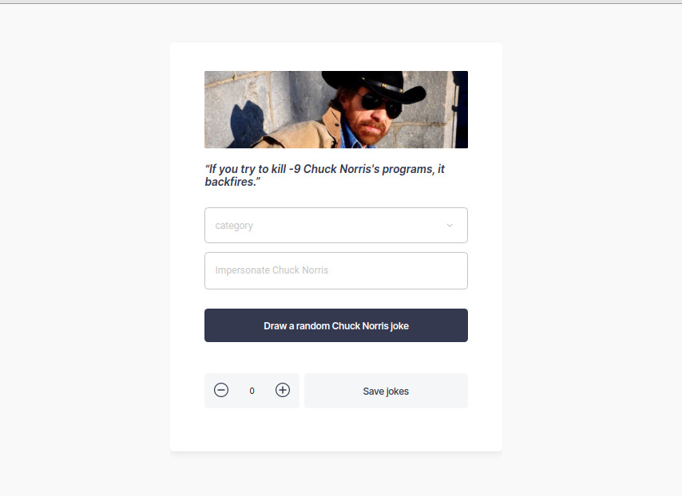

# Chuck Norris Jokes

This project is done by Typescript. It is to display a random Chuck Norris jokes.

- There is a button that can draw a new random jokes.
- If the input name is filled, the new random joke's name will be updated.
- Also, user can be able to draw a random joke based on the chosen category.
- Moreover, user can download jokes in their local machine between 1 to 100

## Design

- [Api](http://www.icndb.com/api/)
- [Design](https://app.zeplin.io/project/60082e93b75072b9b22b0d74/screen/60082ed4fa3fa00293e3a57f)
- [Demo](https://chuck-norris-jokes-noeline.netlify.app/)
- [Source](https://github.com/vakodrazan/chuck-norris-jokes)

## Prerequisites to run the project

clone: https://github.com/vakodrazan/chuck-norris-jokes

- `yarn install` to get the dependecies
- `yarn start` to run the project
